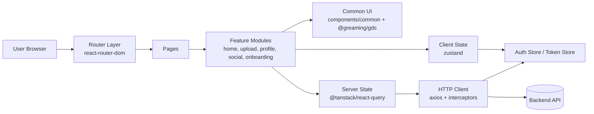
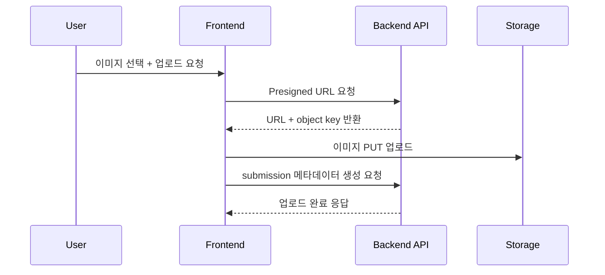

# Greaming FE


그리밍 프론트엔드 레포지토리입니다.  
사용자가 그림을 업로드하고, 데일리/위클리 챌린지에 참여하고, 써클 기반으로 서로의 작업을 탐색/소통할 수 있는 창작 커뮤니티 경험을 제공합니다.

## 서비스 개요

Greaming은 "혼자 그리기 어렵지 않게, 함께 꾸준히 그리도록" 설계한 그림 커뮤니티 서비스입니다.

- 챌린지 중심 홈 피드: `HOME` / `DAILY` / `WEEKLY`
- 업로드 플로우: 일반 업로드 + 챌린지 업로드 + 써클 업로드
- 프로필/관계: 내 프로필, 유저 프로필, 팔로우/팔로잉, 써클 탐색
- 온보딩/로그인: 소셜 로그인 + 초기 설정

## 왜 이런 구조와 기술을 썼는가

| 선택 | 이유 | 기대 효과 |
| --- | --- | --- |
| `React 19` + `TypeScript` | 기능 단위 UI를 빠르게 개발하면서 타입 안정성을 확보 | 화면 확장 시 회귀 버그 감소 |
| `Vite` | 빠른 HMR/빌드 속도로 개발 피드백 루프 단축 | 협업 시 개발 생산성 향상 |
| `react-router-dom` | 레이아웃 단위 라우트 분리(`main/default/logo`)와 인증 가드 구성 용이 | 페이지 구조 확장 시 라우팅 일관성 유지 |
| `@tanstack/react-query` | 서버 상태 캐싱/무한 스크롤/재요청 제어 | API 호출 중복 감소, UX 안정화 |
| `axios` + 인터셉터 | 공통 인증 헤더, 401/403 처리, 토큰 재발급 흐름 중앙화 | 인증 관련 중복 로직 제거 |
| `zustand` | 인증 상태처럼 전역이지만 가벼운 상태를 간단하게 관리 | 보일러플레이트 감소 |
| `Tailwind CSS v4` + `@greaming/gds` | 디자인 토큰 기반 UI 일관성 확보 | 팀원 간 스타일 편차 감소 |

## 아키텍처 인포그래픽

### 1) 프론트엔드 계층 구조



### 2) 업로드 데이터 플로우



## 프로젝트 구조

```bash
frontend/src
├─ pages/               # 라우트 엔트리
├─ features/            # 도메인 기능 모듈
├─ components/common/   # 공통 UI 컴포넌트
├─ apis/                # API 타입/도메인 인터페이스
├─ libs/http/           # axios client, interceptor, endpoint
├─ libs/security/       # auth/token store, refresh 처리
└─ assets/              # 아이콘/배경/로고
```

## 실행 방법

```bash
cd frontend
pnpm install
pnpm dev
```

---

협업 규칙은 하위 문서에서 확인: [frontend/README.md](./frontend/README.md)
