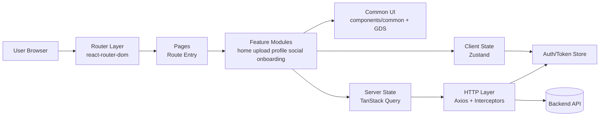
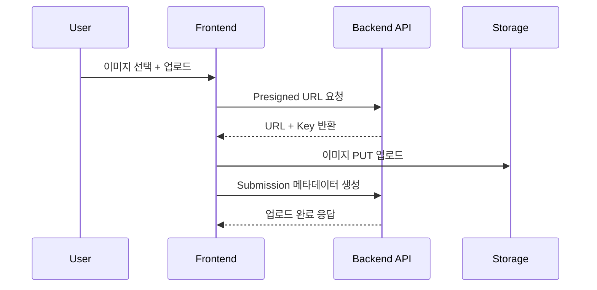

# Greaming FE

<p align="center">
  
</p>

그리밍 프론트엔드는 사용자가 그림을 올리고, 챌린지에 참여하고, 써클/팔로우를 통해 서로의 작업을 발견하는 창작 커뮤니티 웹 서비스입니다.

<br/>

## 서비스 개요

Greaming은 "꾸준히 그리게 만드는 환경"을 목표로 시작했습니다.
혼자 그리면 흐름이 끊기기 쉽기 때문에, 홈 피드와 챌린지, 업로드, 프로필, 커뮤니티 경험을 하나의 여정으로 연결했습니다.

- 챌린지 중심 홈 피드: `HOME` / `DAILY` / `WEEKLY`
- 업로드 플로우: 일반 업로드 + 챌린지 업로드 + 써클 업로드
- 관계/탐색: 내 프로필, 유저 프로필, 팔로우/팔로잉, 써클 탐색
- 온보딩/인증: 소셜 로그인 + 초기 관심사/목표 설정

<br/>

---

<br/>

## 설계 스토리

초기에는 화면을 빠르게 만드는 것이 우선이었지만, 기능이 늘어나면서 같은 문제를 반복해서 마주쳤습니다.

- 화면마다 스타일 기준이 달라지는 문제
- 공통 컴포넌트에 도메인 로직이 섞이는 문제
- API/인증 처리 방식이 페이지마다 달라지는 문제

그래서 아래 3가지를 핵심 원칙으로 고정했습니다.

<br/>

### 1) 디자인 언어를 먼저 통일한다: GDS

`@greaming/gds`와 토큰 기반 스타일을 기준으로 UI를 맞췄습니다.
"예쁜 화면"보다 "팀 전체가 같은 규칙으로 빨리 만드는 화면"에 초점을 맞췄습니다.

- 디자인 토큰 우선: 컬러/타이포/라운드의 임의값 남용 방지
- 컴포넌트 역할 분리: `input`, `display`, `feedback`, `layout`
- 패턴 기준화: 단순 UI는 Flat, 복합 UI는 Compound
- 공통 컴포넌트는 껍데기, 도메인 조합은 `features`에서 수행

이 방식으로 디자이너-프론트 개발자 간 해석 차이를 줄이고, 리뷰 기준을 명확하게 맞출 수 있었습니다.

<br/>

### 2) 기능 단위로 쪼개고, 책임은 고정한다: 현재 폴더 구조

라우팅 진입점과 도메인 기능, 공통 UI, 인프라 코드를 분리해 변경 범위를 작게 유지했습니다.

```bash
frontend/src
├─ pages/               # 라우트 엔트리(페이지 단위 진입)
├─ features/            # 도메인 기능 모듈(화면+훅+API 조합)
├─ components/common/   # 재사용 UI 프리미티브
├─ apis/                # API 타입/도메인 인터페이스
├─ libs/http/           # axios client, interceptor, endpoint
├─ libs/security/       # auth/token store, refresh 처리
└─ assets/              # 아이콘/배경/로고
```

이 구조를 선택한 이유는 명확합니다.

- `pages`는 얇게 유지하고, 실질 기능은 `features`로 집중
- 공통 UI와 비즈니스 로직의 결합 차단
- 인증/네트워크 같은 횡단 관심사는 `libs`에서 단일 관리

결과적으로 기능 추가 시 "어디를 고쳐야 하는지"가 빠르게 결정되고, 충돌 범위도 줄었습니다.

<br/>

### 3) 상태 흐름을 역할별로 분리한다

- 서버 상태: `@tanstack/react-query`
- 경량 전역 상태(인증 등): `zustand`
- HTTP/토큰 재발급: `axios` + interceptor

이 분리 덕분에 무한 스크롤/재요청/인증 만료 대응 같은 복잡한 흐름을 페이지 코드에서 걷어낼 수 있었습니다.

<br/>

---

<br/>

## 아키텍처 인포그래픽

### 기술 스택 맵 (Logo)

<p>
  
  
  
  
  
</p>
<p>
  
  
  
  
  
</p>

### 레이어 아키텍처



### 업로드 플로우



<br/>

---

<br/>

## 실행 방법

```bash
cd frontend
pnpm install
pnpm dev
```

---

협업 규칙은 하위 문서에서 확인: [frontend/README.md](./frontend/README.md)

Greaming 링크 모음:
[Service](https://www.greaming.com/home)
[GDS Repository](https://github.com/Greaming-UMC/GDS)
[GDS on npm](https://www.npmjs.com/package/@greaming/gds)
